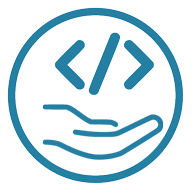

# borrow-ui

<p align="center" style="padding: 10px; background-color: white; margin-right: auto; margin-left: auto; width: 220px; margin-bottom: 10px;">
  
</p>

<br />

<p align="center">
    A simple component library made with React.
</p>
<p align="center">
  Visit <a href="https://www.borrow-ui.dev/">borrow-ui website</a> to see a preview of components styles and to get started!
</p>

<br />

<p align="center">
    <a href="https://coveralls.io/github/borrow-ui/borrow-ui">
        
    </a>
    <a href="https://app.travis-ci.com/github/borrow-ui/borrow-ui">
        
    </a>
    <a href="https://badge.fury.io/js/@borrow-ui%2Fui">
        
    </a>
</p>

<br />
<br />

<div align="center">
    <table>
        <tr>
            <td>
                <a href="https://www.borrow-ui.dev/">Website</a>
            </td>
            <td>
                
            </td>
        </tr>
        <tr>
            <td>
            <a href="https://docs.borrow-ui.dev/">Storybook</a>
            </td>
            <td>
                
            </td>
        </tr>
        <tr>
            <td>
                <a href="https://next.borrow-ui.dev/">Next branch</a>
            </td>
            <td>
                
            </td>
        </tr>
    </table>
</div>

<br />

# borrow-ui project

Welcome to borrow-ui repository! borrow-ui is a simple React component library, which you can extend and/or use as a starting project.

You can navigate the [presentation site](https://www.borrow-ui.dev/).
You can find the [Storybook documentation here](https://docs.borrow-ui.dev/).

This repository uses [`yarn 3`](https://yarnpkg.com/) to organize the code in different packages.

The following packages are available:

- `ui`: the main package, contains the componenty library. It uses `sass` as a CSS preprocessor, `rollup` to build the code and `jest` and `@testing-library/react` for the tests;
- `documentation`: source code of the documentation, based on `storybook`;
- `website-next`: source code of the presentation project website, based on Next.js.

## Why this project?

borrow-ui has been started as a container for simple components that can be used as a base for MVPs, prototype sites and dashboards.
During time, few projects based on the core components grew diverging from each other, so the idea of having a starting point based on common components bootstrapped this project.

Often, when we work on (React) websites, we need very custom functionalities that can't be achieved with common components libraries: we need more props to be passed, having consistent styles for the custom components, passing refs to others or simply understand how a component work to replicate the same functionality on another.

borrow-ui is a set of components which are:

- consistents in styles and code;
- small enough to be understood by anyone with minimal React experience;
- easy to extend;
- tested and documented.

## Quick start

To get started with borrow-ui, understand how the project is structured and see an explanation of the development workflow, have a look at the
[Getting Started](https://www.borrow-ui.dev/getting-started/getting-started) and
[Workflow](https://www.borrow-ui.dev/workflow) pages on the project website.

If you are in a rush, you can use the following commands:

```bash
curl -LJO https://github.com/borrow-ui/borrow-ui/archive/master.zip;
unzip borrow-ui-master.zip && mv borrow-ui-master my-ui-name;
cd my-ui-name;
find . -type f -print0 | xargs -0 sed -i 's/borrow-ui/my-ui-name/g';
yarn
yarn workspace @my-ui-name/documentation run storybook
```

Ready to go! This will start Storybook development server with hot-reload.

Other commands:

- `yarn ui:dev`: develop the UI library with watch mode;
- `yarn ui:test`: run UI unit tests (you can add `--watchAll` to start watch mode);
- `yarn ui:build`: build production version of UI package;

For the full list of commands, see the main `package.json` file and the single packages.

## Roadmap

A user friendly roadmap is available in [the website](https://www.borrow-ui.dev/roadmap), however issues and milestones can be also seen in this repository Issues section.

A focus will be given to tutorials and documentation, as they are part of the main goal of this project.

## Contribute

Contribution are welcome! Any ideas, bug reports, improvements can be suggested/reported in the Issues page of this repository.
