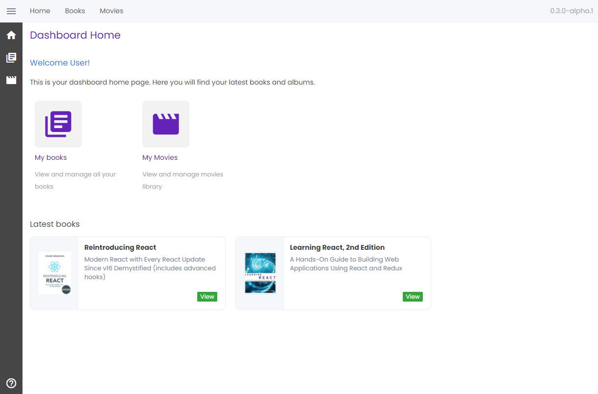

# Dashboard

<div style="width: 90%; margin-left: auto; margin-right: auto; margin-bottom: 20px">
    
</div>

<div align="center">
    <table>
        <tr>
            <td>
                <a href="https://dashboard.borrow-ui.dev/">Dashboard demo</a>
            </td>
            <td>
                
            </td>
        </tr>
    </table>
</div>

This project contains a Dashboard based on `borrow-ui` and [Create React App](https://github.com/facebook/create-react-app).

The Dashboard has:

-   a landing page;
-   a folder with common components;
-   two applications, to show how to organise the code for multiple apps;
-   no memory (database): everything is restored after refresh;
-   an example of a form with controlled components and one with uncontrolled components,
    with different ways of importing and using the form controllers.

The Dashboard does not follow common React best practices for:

-   tests: components are not tested, and not extensively documented;
-   API: everything is in memory, using a global context;
-   URL/parameters/input sanitization and check;
-   catch on promises;
-   custom pages (i.e. 404).

Despite this, it can be used as a starter project to create a multi application dashboard,
already setup to use the components library.

## Commands

To start the dashboard in development mode, run

```bash
yarn start
```

This will open the Dashboard on the default CRA address, [http://localhost:3000](http://localhost:3000).

To build the project, run

```bash
yarn build
```
